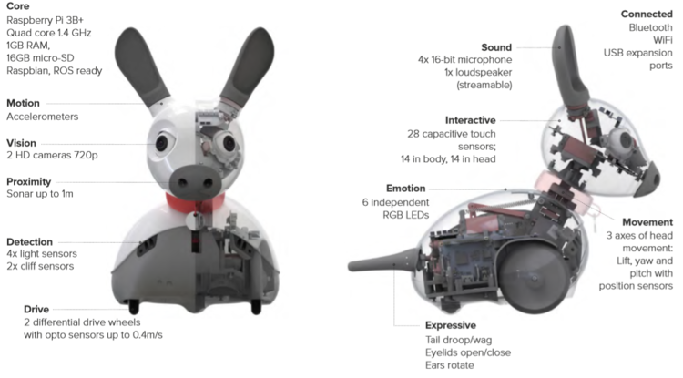
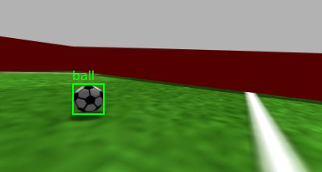
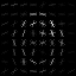
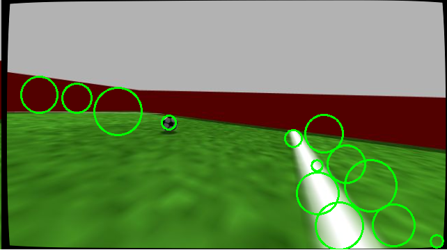
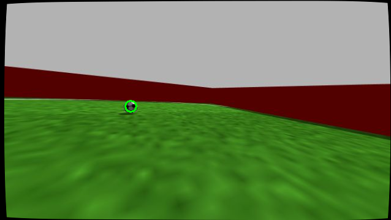
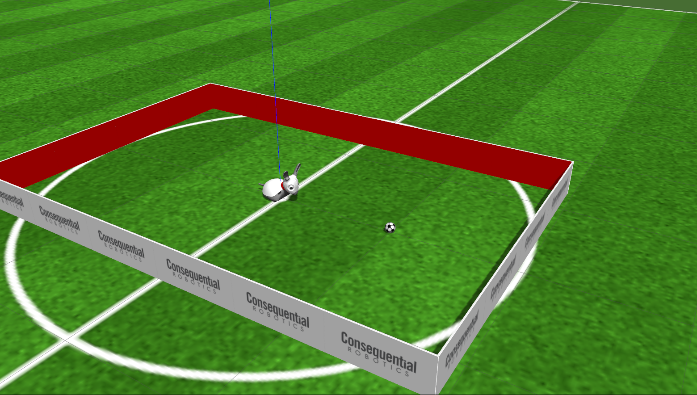
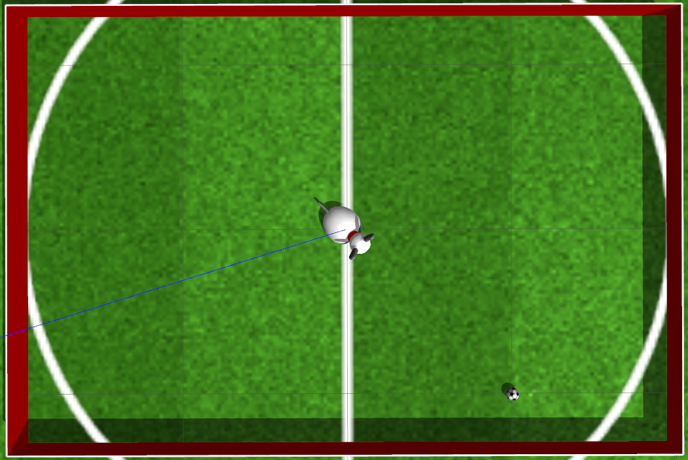

# Robot Football with the MiRo Robot: Ball Perception and Trajectory Prediction

## Abstract

Robot football is a problem in which two opposing teams of robots autonomously play a
game of football. Robots are developed not just to compete in these games, but to develop
new technologies for the wider field of robotics. A key part of the problem is developing an
effective method of ball awareness for the robot.  
The aim of this project is to build a ball perception system and trajectory prediction for
the MiRo robot. This involves creating a computer vision algorithm which is robust to a
very dynamic world state, as well as accurately modelling the trajectory of the ball, to allow
players to quickly and efficiently intercept it.  
The project successfully develops an efficient ball detection algorithm using non-neural
methods including a circular Hough transform and a support-vector machine classifier with
a histogram of oriented gradients feature descriptor, as well as overcoming problems with
image space to world space conversion.

[Paper](dissertation/Robot_Football_Perception.pdf)

## MiRo 

https://www.miro-e.com/  
A social robot designed for education and research by Consequential Robotics.

## Setup

Developed on Ubuntu 20.04, using ROS 1 and the MiRo Development Kit (available within University of Sheffield).

To install required packages:
`pip install -r requirements.txt`

To run:

`roscore`

`roslaunch miro_football_perception look_at_ball.launch`

or

`roslaunch miro_football_perception scenarios.launch`

## Images

